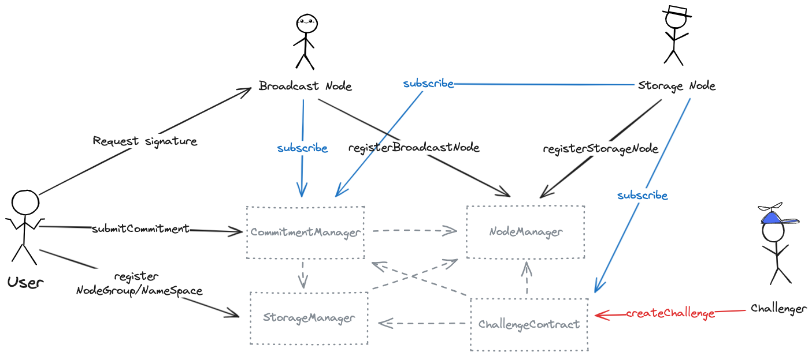

# multiAdaptive-contracts

## Smart Contracts

- **[NodeManager](https://github.com/MultiAdaptive/multiAdaptive-contracts/blob/master/src/NodeManager.sol)**  
  NodeManager is responsible for the registration and management of storage nodes and broadcast nodes. Users can also query the list and status of nodes through this contract.
- **[StorageManager](https://github.com/MultiAdaptive/multiAdaptive-contracts/blob/master/src/StorageManager.sol)**   
  The StorageManager contract is responsible for the registration and management of nodeGroups and namespaces.
    - nodeGroup: A group of broadcast nodes, with a specified minimum number of signatures required.
    - nameSpace: A group of storage nodes.
- **[CommitmentManager](https://github.com/MultiAdaptive/multiAdaptive-contracts/blob/master/src/CommitmentManager.sol)**   
  CommitmentManager handles commitments submitted by users, verifies signatures based on the nodeGroupKey, and deducts fees accordingly.
- **[ChallengeContract](https://github.com/MultiAdaptive/multiAdaptive-contracts/blob/master/src/ChallengeContract.sol)**  
  ChallengeContract allows challengers to create challenges by specifying the nameSpaceKey and storage node address. The contract facilitates interaction between challengers and storage nodes to reach a final challenge outcome.
- **[Verifier](https://github.com/MultiAdaptive/multiAdaptive-contracts/blob/master/src/kzg/Verifier.sol)**  
  Verifier provides an implementation of the KZG algorithm using the BN254 curve.

## Role
- **BroadcastNode**  
  Broadcast nodes register by staking tokens in NodeManager.sol. They provide temporary data storage and signatures for users. They subscribe to messages from CommitmentManager.sol and broadcast data across the network based on commitment information.
- **StorageNode**  
  Storage nodes register by staking tokens in NodeManager.sol. They provide long-term storage services for users. They subscribe to messages from CommitmentManager.sol and request data across the network based on commitment information for long-term storage.  
  They also subscribe to events in ChallengeContract.sol to respond to challenges by uploading aggregated commitments/proofs/opening values to ChallengeContract.sol to complete the challenge.
- **User**  
  Users can view registered broadcast nodes and storage nodes through the NodeManager.sol contract. After selecting the desired nodes, they can register a nodeGroup for broadcast nodes and a namespace for storage nodes if long-term storage is needed.  
  Users send data to the broadcast nodes to obtain signatures, and after obtaining the signatures, they call the submitCommitment method in CommitmentManager.sol to submit their commitment.
- **Challenger**  
  Challengers can create challenges in ChallengeContract.sol by specifying the nameSpaceKey and storage node address. They need to interact with the contract to reach a consensus on the aggregated commitment. The contract will use KZG verification to determine the challenge outcome.

## Data Audit Scheme

### Overview of the Scheme

A user(project) can challenge a storage node(storage provider) that stores its data. The challenge needs to specify the commitment range, such as the data within the first commitment to the 1000th commitment submitted by the user.When each time the project submits data to storage contract, the contract records the commitments $cm_i$ corresponding to each data submission and the corresponding polynomials $f_i(x)$. Assuming data has been submitted a total of $t$ times when the project needs to initiate a full audit, they must generate $t$ random numbers $r_i$ and a random value $v$,where the $t$ random numbers $r_i$ is used to combine $t$ commitmens $cm_i$ to $CM_{0,t-1}=\sum_{i\in [0,t-1]}r_icm_i$ or combine $t$ polynomials $f_i(x)$ to $F(x)=\sum_{i\in [0,t-1]}r_if_i(x)$, and the random value $v$ is used to open the polynomial $F(x)$.To facilitate calculations within the contract, you can set $r_i$, where $r$ is a seed selected by the project and $r_i=hash(r||i)$.Because each polynomial $f_i(x)$ corresponds to a commitment $cm_i$, the commitment corresponding to the polynomial $F(x)$ is $CM_{0,t-1}=\sum_{i\in [0,t-1]}r_icm_i$. When the value of $t$ is large, calculating this commitment in the contract may be challenging. Therefore, we have designed an interactive challenge protocol to ensure that the project and storage provider can reach consensus on the aggregated commitment $CM_{0,t-1}$. After reaching consensus on the commitment $CM_{0,t-1}$, challenge, response, and verification are performed.

### Scheme Details

We can divide the scheme into two parts.The first part uses an interactive protocol to reach consensus between the project and storage provider on the aggregated commitment.The second part involves the process of challenge, responce, and verify among the project, storage provider, and contract.

#### Consensus on Aggregated Commitments

The main purpose of this part is to reach consensus  between the project and the storage provider on aggregated commitment. If consensus cannot be reached, the dishonest party needs to be identified by the contract. Before calculating the aggregated commitment, the project has already set random numbers $r$ and uploaded them to the contract.
First, the storage provider submits $CM_{0,t-1}=\sum_{i\in [0,t-1]}r_i cm_i,r_i=hash(r||i)$.If the project aggree the aggregated commitment $CM_{0,t-1}$, then reach consensus. If the project disagrees, it indicates the presence of a dishonest party between the project and the storage provider and the contract need to find the dishonest party.The storage provider need to continuously submit $CM_{0,(t-1)/2}$ to the contract in an interactive binary manner until a consensus aggregated commitment $CM_{0,j}$ and a non-consensus aggregated commitment $CM_{0,j+1}$ are found. At this point,the contract determines whether the dishonest party is the project or the storage provider by verifying whether $CM_{i,j+1}=CM_{i,j}+r_{j+1}cm_{j+1}$. If the equation holds, it indicates that the dishonest party is the project, otherwise, the dishonest party is the storage provider.
In the `submitOpinion` function of the project file `ChallengeContract.sol`, the consensus on the aggregate commitment can be determined.

**Calculate the aggregated commitment**

During the period of determining whether the aggregate commitment has reached consensus, the storage provider  need to calculate aggregate commitments $CM_{0,j}=\sum_{i\in [0,j]}r_i cm_i,r_i=hash(r||i)$.
In the `FoldedCommits` function in the `kzgSDK/sdk.go` file, the aggregate commitment can be calculated.

#### Challenge, Response, and Verification

The prerequisite for this part is that both the project and the storage provider have reached consensus on the aggregated commitment corresponding to $t$ sets of data.The following steps are performed sequentially: Challenge, Response, and Verification.

**Challenge**

Challenge is initiated by the project, which selects an opening point $v$ and sends it to the contract. The contract then forwards the opening point $v$ to the  storage provider

**Response**

The storage provider receives the challenge value $v$,and to compute the opening value of point $v$ using its held aggregated polynomial $F(x)=\sum_{i\in[0,t-1]}r_i f_i(x)$ and provide the corresponding evaluation proof $C_{q(x)}$. The data storage provider then sends the opening value $F(v)$ and evaluation proof $C_{q(x)}$ to the contract for verification.

In the `Responce` function in the `kzgSDK/sdk.go` file, the responce can be calculated.

**Verification**

Finally, using the opening value $F(v)$ and the evaluation proof $C_{q(x)}$ from the storage provider, the verifier on the contract can determine whether the storage provider holds genuine data by verifying whether the equation $e(CM_{0,t-1}-F(v)G_1, G_2) = e(C_{q(x)}, (x-v)G_2)$ holds true. 

In the `verify` function of the project file `kzg/Verifier.sol`, the verification can be done.

